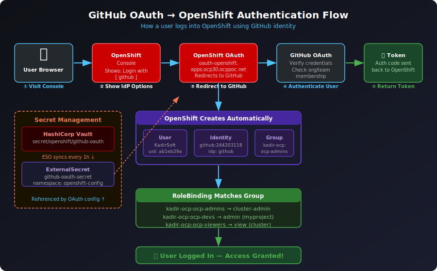
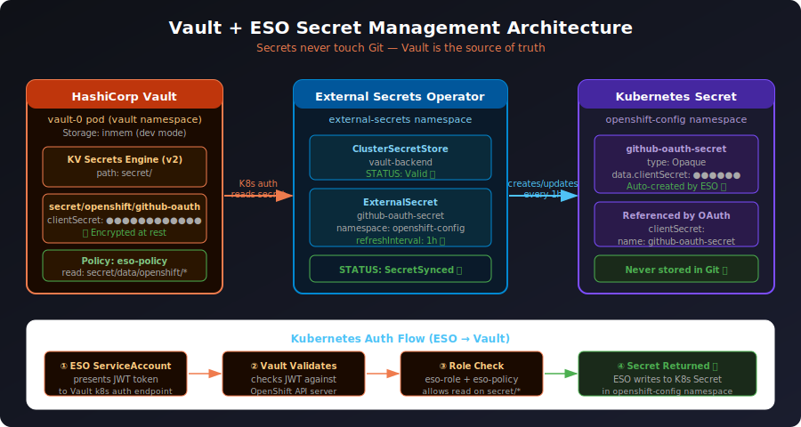
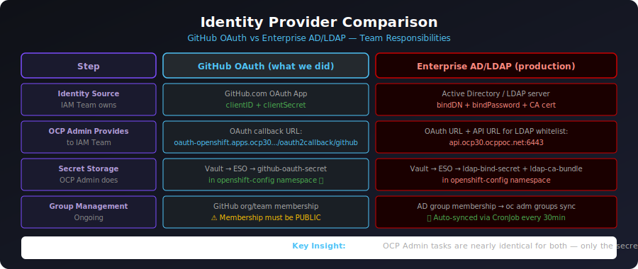

# OpenShift OAuth — GitHub Identity Provider Setup

> Complete guide for configuring GitHub OAuth with HashiCorp Vault + External Secrets Operator on OpenShift.
> Built from real hands-on setup and troubleshooting.

---

## Table of Contents

1. [Visual Diagrams](#visual-diagrams)
2. [Architecture Overview](#architecture-overview)
3. [Prerequisites](#prerequisites)
4. [Chapter 1 — HashiCorp Vault Setup](#chapter-1--hashicorp-vault-setup)
5. [Chapter 2 — External Secrets Operator](#chapter-2--external-secrets-operator)
6. [Chapter 3 — GitHub OAuth App](#chapter-3--github-oauth-app)
7. [Chapter 4 — Configure OpenShift OAuth](#chapter-4--configure-openshift-oauth)
8. [Chapter 5 — GitHub Org & Teams](#chapter-5--github-org--teams)
9. [Chapter 6 — Map Teams to OpenShift RBAC](#chapter-6--map-teams-to-openshift-rbac)
10. [Common Errors & Fixes](#common-errors--fixes)
11. [Enterprise AD/LDAP vs GitHub OAuth](#enterprise-adldap-vs-github-oauth)
12. [Quick Reference Commands](#quick-reference-commands)

---

## Visual Diagrams

### OAuth Authentication Flow


### Vault + ESO Architecture


### GitHub Teams → OpenShift RBAC


### IdP Comparison (GitHub OAuth vs Enterprise AD)


---

## Architecture Overview

```
GitHub Org (kadir-ocp)
  └── Teams: ocp-admins, ocp-devs, ocp-viewers
        ↓ GitHub OAuth App (clientID + clientSecret)
HashiCorp Vault (vault namespace on OpenShift)
  └── secret/openshift/github-oauth
        ↓ External Secrets Operator syncs every 1h
K8s Secret: github-oauth-secret (openshift-config namespace)
        ↓ Referenced by OAuth config
OpenShift OAuth configured
        ↓ Login with GitHub
User authenticated → Groups created → RoleBindings applied
        ↓
Access granted based on GitHub team membership ✅
```

---

## Prerequisites

| Requirement | Details |
|------------|---------|
| OpenShift cluster | 4.x with admin access |
| Helm | v3+ installed locally |
| GitHub account | With org creation rights |
| `oc` CLI | Logged in as cluster-admin |

Check OAuth route:
```bash
oc get route oauth-openshift -n openshift-authentication
# HOST: oauth-openshift.apps.<cluster-domain>
```

---

## Chapter 1 — HashiCorp Vault Setup

### Install Vault on OpenShift

```bash
# Create namespace
oc new-project vault

# Add Helm repo
helm repo add hashicorp https://helm.releases.hashicorp.com
helm repo update

# Install Vault (dev mode)
helm install vault hashicorp/vault \
  --namespace vault \
  --set "global.openshift=true" \
  --set "server.dev.enabled=true" \
  --set "server.image.repository=docker.io/hashicorp/vault" \
  --set "server.image.tag=1.15.2"

# Verify
oc get pods -n vault
```

> ⚠️ Dev mode uses in-memory storage — data lost on pod restart. Use HA mode with persistent storage for production.

### Verify Vault Status

```bash
oc exec -n vault vault-0 -- vault status
# Sealed: false ✅
# Initialized: true ✅
```

### Configure Vault

```bash
# Enable KV secrets engine
oc exec -n vault vault-0 -- vault secrets enable -path=secret kv-v2

# Create ESO policy
oc exec -n vault vault-0 -- /bin/sh -c 'vault policy write eso-policy - << EOF
path "secret/data/openshift/*" {
  capabilities = ["read"]
}
EOF'

# Enable Kubernetes auth
oc exec -n vault vault-0 -- vault auth enable kubernetes

# Configure Kubernetes auth
oc exec -n vault vault-0 -- /bin/sh -c 'vault write auth/kubernetes/config \
  kubernetes_host="https://$KUBERNETES_PORT_443_TCP_ADDR:443"'

# Create ESO role
oc exec -n vault vault-0 -- vault write auth/kubernetes/role/eso-role \
  bound_service_account_names=external-secrets \
  bound_service_account_namespaces=external-secrets \
  policies=eso-policy \
  ttl=1h
```

### Store GitHub OAuth Secret in Vault

```bash
oc exec -n vault vault-0 -- vault kv put secret/openshift/github-oauth \
  clientSecret="YOUR_GITHUB_CLIENT_SECRET"

# Verify
oc exec -n vault vault-0 -- vault kv get secret/openshift/github-oauth
```

---

## Chapter 2 — External Secrets Operator

### Install ESO

```bash
# Create namespace
oc new-project external-secrets

# Add Helm repo
helm repo add external-secrets https://charts.external-secrets.io
helm repo update

# Install with CRDs
helm install external-secrets \
  external-secrets/external-secrets \
  --namespace external-secrets \
  --set installCRDs=true

# Verify pods
oc get pods -n external-secrets
```

### Verify CRDs

```bash
oc api-resources | grep external-secrets
# clustersecretstores   external-secrets.io/v1   ← note: v1 not v1beta1
# externalsecrets       external-secrets.io/v1
```

### Create ClusterSecretStore

```bash
cat <<'EOF' | oc apply -f -
apiVersion: external-secrets.io/v1
kind: ClusterSecretStore
metadata:
  name: vault-backend
spec:
  provider:
    vault:
      server: "http://vault.vault.svc.cluster.local:8200"
      path: "secret"
      version: "v2"
      auth:
        kubernetes:
          mountPath: "kubernetes"
          role: "eso-role"
          serviceAccountRef:
            name: "external-secrets"
            namespace: "external-secrets"
EOF

# Verify
oc get clustersecretstore vault-backend
# STATUS: Valid   READY: True ✅
```

### Create ExternalSecret

```bash
cat <<'EOF' | oc apply -f -
apiVersion: external-secrets.io/v1
kind: ExternalSecret
metadata:
  name: github-oauth-secret
  namespace: openshift-config
spec:
  refreshInterval: 1h
  secretStoreRef:
    name: vault-backend
    kind: ClusterSecretStore
  target:
    name: github-oauth-secret
    creationPolicy: Owner
  data:
  - secretKey: clientSecret
    remoteRef:
      key: openshift/github-oauth
      property: clientSecret
EOF

# Verify
oc get externalsecret github-oauth-secret -n openshift-config
# STATUS: SecretSynced   READY: True ✅

oc get secret github-oauth-secret -n openshift-config
# TYPE: Opaque   DATA: 1 ✅
```

---

## Chapter 3 — GitHub OAuth App

### Create OAuth App

Go to: **github.com/settings/applications/new**

| Field | Value |
|-------|-------|
| Application name | `openshift-auth` |
| Homepage URL | `https://console-openshift-console.apps.<cluster-domain>` |
| Callback URL | `https://oauth-openshift.apps.<cluster-domain>/oauth2callback/github` |

Click **Register application** then:
1. Note the **Client ID**
2. Click **Generate a new client secret** (shown once — save it!)

### Get Exact Callback URL

```bash
oc get route oauth-openshift -n openshift-authentication
# Use: https://<HOST>/oauth2callback/github
```

---

## Chapter 4 — Configure OpenShift OAuth

### Patch OAuth Config

```bash
oc patch oauth cluster --type=merge -p '{
  "spec": {
    "identityProviders": [{
      "name": "github",
      "type": "GitHub",
      "mappingMethod": "claim",
      "github": {
        "clientID": "YOUR_GITHUB_CLIENT_ID",
        "clientSecret": {
          "name": "github-oauth-secret"
        },
        "teams": [
          "kadir-ocp/ocp-admins",
          "kadir-ocp/ocp-devs",
          "kadir-ocp/ocp-viewers"
        ]
      }
    }]
  }
}'
```

> ⚠️ Use either `organizations` OR `teams` — not both. `teams` is more specific and enables group auto-creation.

### Restart OAuth Pod

```bash
oc rollout restart deployment/oauth-openshift -n openshift-authentication
oc get pods -n openshift-authentication -w
```

### Verify

```bash
oc get oauth cluster -o yaml
```

---

## Chapter 5 — GitHub Org & Teams

### Create GitHub Organization

Go to: **github.com/organizations/new**

### Create Teams

Go to: **github.com/orgs/YOUR-ORG/new-team**

| Team | Purpose |
|------|---------|
| `ocp-admins` | Cluster administrators |
| `ocp-devs` | Namespace developers |
| `ocp-viewers` | Read-only access |

### ⚠️ Critical — Make Membership Public

1. Go to **github.com/orgs/YOUR-ORG/people**
2. Find your username
3. Click **Private ▼** → Select **Public**

> GitHub OAuth only sees **public** org memberships. Private membership = invisible to OpenShift = login fails!

---

## Chapter 6 — Map Teams to OpenShift RBAC

```bash
# ocp-admins → full cluster admin
oc adm policy add-cluster-role-to-group cluster-admin kadir-ocp:ocp-admins

# ocp-devs → admin on specific namespace
oc adm policy add-role-to-group admin kadir-ocp:ocp-devs -n myproject

# ocp-viewers → read-only cluster-wide
oc adm policy add-cluster-role-to-group view kadir-ocp:ocp-viewers
```

> Groups appear as `orgname:teamname` in OpenShift. Warning "Group not found" is expected — groups are created automatically on first login.

### Verify After Login

```bash
oc get users
oc get identity
oc get groups
```

---

## Common Errors & Fixes

### Error 1 — Authentication Error: Not a member of any allowed organizations

```
User KadirSoft is not a member of any allowed organizations [kadir-ocp]
(user is a member of [])
```

**Causes & Fixes:**

| Cause | Fix |
|-------|-----|
| Membership is Private | Go to org People → change to Public |
| Not in org yet | Accept org invitation from email |
| Using personal account as org | Use `teams` not `organizations` in OAuth config |

### Error 2 — Using organizations AND teams together

```
specify organizations or teams, not both
```

**Fix:** Remove `organizations` field, use only `teams`:
```yaml
"teams": ["kadir-ocp/ocp-admins", "kadir-ocp/ocp-devs"]
```

### Error 3 — CRD not found (ESO)

```
no matches for kind "ClusterSecretStore" in version "external-secrets.io/v1beta1"
```

**Fix:** Use `v1` not `v1beta1`:
```yaml
apiVersion: external-secrets.io/v1   # ← correct
```

### Error 4 — Vault policy heredoc fails

```
'policy' parameter not supplied or empty
```

**Fix:** Use single quotes in the heredoc:
```bash
oc exec -n vault vault-0 -- /bin/sh -c 'vault policy write eso-policy - << EOF
path "secret/data/openshift/*" {
  capabilities = ["read"]
}
EOF'
```

### Error 5 — ImagePullBackOff for Vault

```
Failed to pull image "hashicorp/vault:1.21.2": image not found in registry.connect.redhat.com
```

**Fix:** Specify docker.io explicitly:
```bash
helm upgrade vault hashicorp/vault \
  --namespace vault \
  --set "global.openshift=true" \
  --set "server.dev.enabled=true" \
  --set "server.image.repository=docker.io/hashicorp/vault" \
  --set "server.image.tag=1.15.2"

oc delete pod vault-0 -n vault  # force restart with new image
```

---

## Enterprise AD/LDAP vs GitHub OAuth

### Team Responsibilities

| Step | GitHub OAuth | Enterprise AD | Team |
|------|-------------|---------------|------|
| Set up identity source | GitHub OAuth App | AD server + service account | **IAM Team** |
| Share credentials | clientID + Secret | bindDN + password + CA cert | **IAM Team** |
| Share cluster URL | oauth-openshift URL | oauth-openshift URL | **OCP Admin** |
| Store secret | Vault → ESO | Vault → ESO | **OCP Admin** |
| Configure OAuth | `oc patch oauth` | `oc patch oauth` | **OCP Admin** |
| Group management | GitHub team membership | AD group membership | **IAM Team** |
| Group sync | Manual / on login | CronJob every 30min | **OCP Admin** |

### LDAP OAuth Config (for reference)

```yaml
identityProviders:
- name: ActiveDirectory
  type: LDAP
  ldap:
    url: "ldaps://ad.company.com/ou=users,dc=company,dc=com?sAMAccountName"
    bindDN: "cn=ocp-svc,ou=serviceaccounts,dc=company,dc=com"
    bindPassword:
      name: ldap-bind-secret         # from Vault via ESO
    ca:
      name: ldap-ca-bundle           # CA cert from IAM team
    attributes:
      id: ["sAMAccountName"]
      email: ["mail"]
      name: ["cn"]
```

### LDAP Group Sync

```bash
# Manual sync
oc adm groups sync --sync-config=ldap-sync-config.yaml --confirm

# Automated via CronJob (every 30min)
# See: ldap-group-sync-cronjob.yaml
```

---

## Quick Reference Commands

```bash
# Vault
oc get pods -n vault
oc exec -n vault vault-0 -- vault status
oc exec -n vault vault-0 -- vault kv get secret/openshift/github-oauth
oc exec -n vault vault-0 -- vault policy list
oc exec -n vault vault-0 -- vault auth list

# ESO
oc get pods -n external-secrets
oc get clustersecretstore
oc get externalsecret -n openshift-config
oc get secret github-oauth-secret -n openshift-config

# OAuth
oc get oauth cluster -o yaml
oc get pods -n openshift-authentication
oc logs -n openshift-authentication deployment/oauth-openshift | grep -i error
oc rollout restart deployment/oauth-openshift -n openshift-authentication

# Users & Groups
oc get users
oc get identity
oc get groups
oc describe group kadir-ocp:ocp-admins

# RBAC
oc get clusterrolebinding | grep kadir-ocp
oc get rolebinding -n myproject | grep kadir-ocp
oc adm policy add-cluster-role-to-group cluster-admin kadir-ocp:ocp-admins
oc adm policy add-role-to-group admin kadir-ocp:ocp-devs -n myproject
oc adm policy add-cluster-role-to-group view kadir-ocp:ocp-viewers

# Check what a user can do
oc auth can-i create pods -n myproject --as KadirSoft
oc auth can-i delete deployments -n myproject --as KadirSoft
```

---

## Key Lessons Learned

| Lesson | Detail |
|--------|--------|
| GitHub membership must be Public | Private org membership is invisible to OAuth — always set to Public |
| Use `teams` OR `organizations` not both | OpenShift OAuth config only accepts one |
| ESO API version is `v1` not `v1beta1` | Always check `oc api-resources` for correct version |
| Vault image needs docker.io prefix | OpenShift tries registry.connect.redhat.com by default |
| Groups created on first login | "Group not found" warning when creating RoleBindings is expected |
| Never store secrets in Git | Always use Vault → ESO → K8s Secret pattern |
| Rotating secrets is easy with ESO | Update Vault → ESO auto-syncs within refreshInterval |
| OCP Admin tasks same for any IdP | Only secret type and group sync method differs between GitHub and AD |
